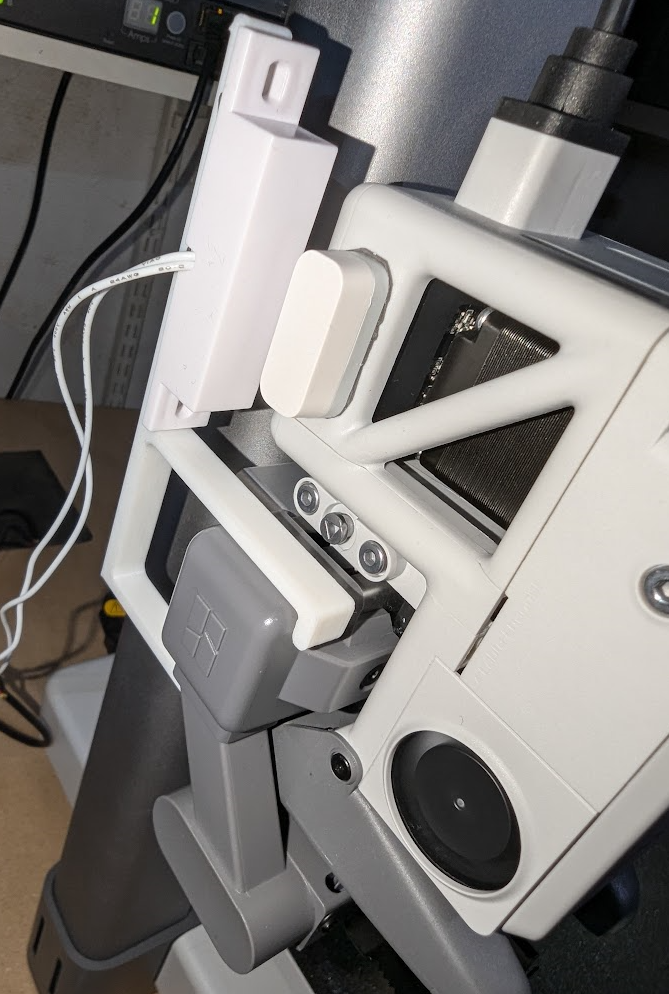

# BambuLab-Smooth-Timelapse
Make beautiful Timelapses on your Bambu Lab printer using the build in Timelapse support in Bambu Studio. Using a external camera.

The idea can be used on all Bambu Lab printers, but the designs i have made is for the Bambu Lab A1.

<iframe width="560" height="315" src="https://www.youtube.com/embed/zzbIBHHvKSc" frameborder="0" allowfullscreen></iframe>

## Requirements
A door sensor connected to your Raspberry Pi, that is placed on the printer where it can detect when it goes to for taking a picture internally. 

This way we do not change anything regarding GCODE or other stuff in Bambu Studio, only using already existing features.

I used a simple magnetic door sensor that I connected to the GPIO pins on the Raspberry Pi. Which can be found here: https://www.aliexpress.com/item/1005006027619189.html

Connected to ground and PIN 26.

You also need to have a camera that is supported by gphoto2. I used a Sony A6000. The commands we run when taking a picture can be found and modified in the run.sh file.

## Installation
1. Print this design: 
2. Connect the door sensor to your Raspberry Pi
3. Install the door sensor to the design you printed and install on the A1.
4. Install the magnet on the printing head of the A1.
5. You might wanna run a full calibration of the printer again, just to be safe. As you have changed the weight on the printing head.

## Installation on Raspberry Pi
1. Git clone or download the repository to your Raspberry Pi
2. chmod +x run.sh
3. python3 run.py
4. Test that it takes a picture by moving the magnet to the door sensor.